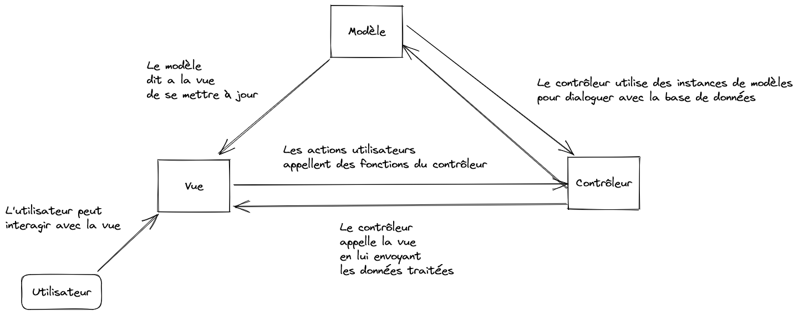

# ISI3 - MVC design pattern - "Game of Life"

> Le rapport est à fournir dans ce document sous chacune des questions.

> Ne copiez pas le code de votre voisin, ça se voit.

Nom/Prénom: `OULED MOUSSA Yanis - BRAGA Jonathan`

Lien du projet: https://www.yanis-ouled-moussa.fr/Cours/Game_Of_Life/

> Pour générer un codesandbox associé à votre code, [suivre cette doc](https://codesandbox.io/docs/importing#import-from-github).

Vous pouvez tester le code directement sur votre navigateur, à condition de lancer un serveur local. Par exemple :

```python3 -m http.server 8000```

Votre programme sera accessible depuis l'adresse `http://localhost:8000/index.html`.


## Game of Life

Le jeu de la vie est un automate cellulaire qui répond à des règles très simple.
Il a été inventé par [John Horton Conway](https://fr.wikipedia.org/wiki/John_Horton_Conway) (1937-2020).

## Avant-propos

1. Expliquer le design pattern MVC à l'aide d'un schéma à insérer directement ici.
Utiliser un outils comme Dia pour le représenter. Je veux **votre** schéma, pas un de ceux qu'on peut trouver sur le net.



2. Expliquer ce pattern en complétant ce texte.

Le pattern MVC, vise à découper le `Modèle (données)`, de la `Vue (affichage)` et du `Contrôleur (Traitement)` afin de rendre le code plus `modulable`.
Les responsabilités ne sont alors plus `partagées`.
On peut ainsi changer l'aspect visuel de son application sans pour autant impacter le `fonctionnement`.

3. Expliquer dans quels cas on doit privilégier le pattern MVC.

On privilégie l’utilisation du pattern MVC lorsqu’on doit faire un affichage visuel dans un programme. Cela peut être pour des sites web ou des applications. L’intérêt de l’utiliser est de séparer les différents composants de l’application (données, traitements et affichages). Ce qui permet de modifier une partie de l’application sans impacter les autres.

## À faire (obligatoire)

- Rendre le jeu fonctionel tout en respectant le design pattern MVC.
- Le bouton `start` doit lancer le jeu.
- Le bouton `stop` doit arrêter le jeu en l'état, le `start` relance le jeu.
- le bouton `reset` arrête le jeu et remet à la grille à l'état initial.

### Observer Observable

Afin de mettre à jour la vue à chaque nouvelle génération du jeu, la fonction `updated` doit notifier la view afin qu'elle se mette à jour.
Cela relève du design pattern Observer/Observable.

1. Expliquer votre implémentation:

L'usage d'un callback permet ici de `notifier` afin de dire à la _View_ de se redessiner.
L'objet _Model_ n'a pas de lien avec `_View_` pourtant grâce à la `méthode «updated()»` il peut notifier la `_View_`.

2. Insérer ici un UML montrant le pattern Observer/Observable lié aux objets de ce TP.


## Optionnel

> Si vous voulez apprendre d'autres choses

- Faire en sorte de pouvoir changer les dimensions de la grille par un `<input/>` HTML.
- Faire en sorte de pouvoir modifier l'état d'une cellule en cliquant dessus.

Nous avons implémenté, en plus de ce qui était demandé, les fonctionalités suivantes :
- Un système de "zoom". Lorsque l'utilisateur scroll avec sa souris dans le canvas du jeu, cela augmente ou diminue la ``GRID_SIZE`` ayant pour effet d'augmenter ou de rétrécir la zone de jeu.
- Un système permettant de modifier l'état d'une cellule en cliquant dessus. L'état des cellules est égalment sauvegardé lorsque cette action est réalisée quand le jeu est en pause.
- Nous avons aussi modifier la disposition des cellules de base pour y afficher un [gun](https://en.wikipedia.org/wiki/Gun_(cellular_automaton)) qui permet de générer des [gliders](https://en.wikipedia.org/wiki/Glider_(Conway%27s_Life)) à l'infini, par défaut.

## :warning: À rendre

- Une URL de codesandox pointant sur votre projet github afin que je puisse voir et tester le code.
- Le rapport complet.
